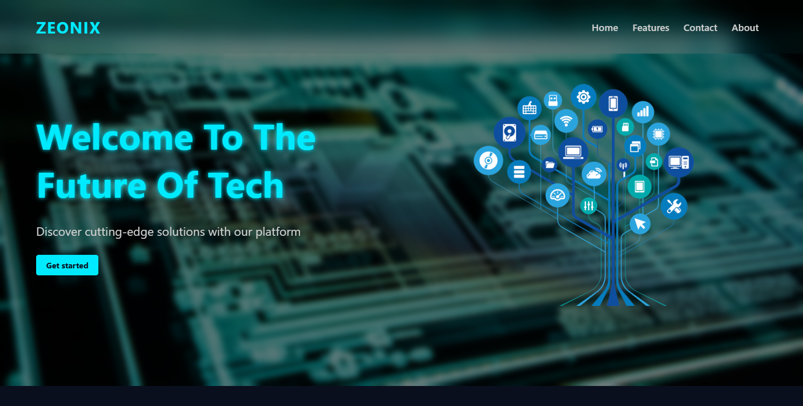

# 🚀 Zeonix - Futuristic Tech Landing Page

Zeonix is a **modern, high-tech landing page** designed with **a neon, futuristic aesthetic**. This project is fully **responsive**, featuring **smooth animations, a sleek hamburger menu, and dynamic scroll effects**.

## 🌟 Features

- **Fully Responsive** 📱 - Works perfectly on all screen sizes.
- **Dynamic Scroll Animations** 🎭 - Sections slide in as you scroll.
- **Hamburger Menu** 🍔 - A sleek, slide-in menu for mobile users.
- **Neon-Themed UI** 🌌 - Inspired by cyberpunk and futuristic aesthetics.
- **Optimized Performance** ⚡ - Uses the Intersection Observer API for smooth animations.

## 📸 Screenshots



## 🛠️ Technologies Used

- **HTML5** - For the page structure.
- **CSS3** (Flexbox & Grid) - For styling and responsive design.
- **JavaScript (ES6+)** - For interactive features and animations.

## 📂 Project Structure

```
/zeonix-landing-page
│── index.html        # Main HTML file
│── styles.css        # Stylesheet for the landing page
│── script.js         # JavaScript for animations and interactivity
│── /img/             # Folder for images and icons
│── README.md         # Project documentation (this file)
```

## 🚀 How to Run the Project

1. **Clone the Repository**
   ```sh
   git clone https://github.com/Vortex105/zeonix-landing-page.git
   ```
2. **Open the `index.html` file** in your browser.
3. Enjoy the **fully interactive** Zeonix experience!

## 🔧 Features Breakdown

### ✅ **1. Smooth Scroll Animations**

- Uses **Intersection Observer API** to animate elements when they enter the viewport.
- Scroll effects include **fade-in, slide-left, and slide-right**.

### ✅ **2. Mobile-Optimized Hamburger Menu**

- Click the ☰ **hamburger icon** to slide in the navigation menu from the right.
- Uses **CSS transitions** for a smooth effect.

### ✅ **3. Custom Neon UI & Hover Effects**

- Modern, **glowing hover effects** on buttons and text.
- Inspired by **cyberpunk & futuristic** UI designs.

## 📜 License

This project is **open-source** under the [MIT License](LICENSE).

## 💡 Author

Developed by [SESESHE](https://github.com/Vortex105). If you like this project, feel free to ⭐ star the repo and contribute!

---

🎉 **Enjoy building with Zeonix!** 🎉
